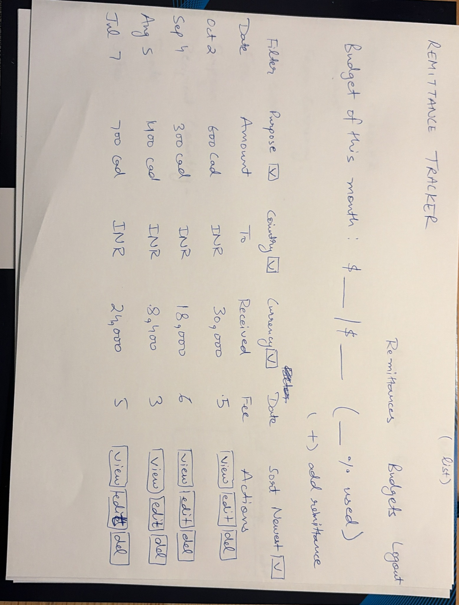
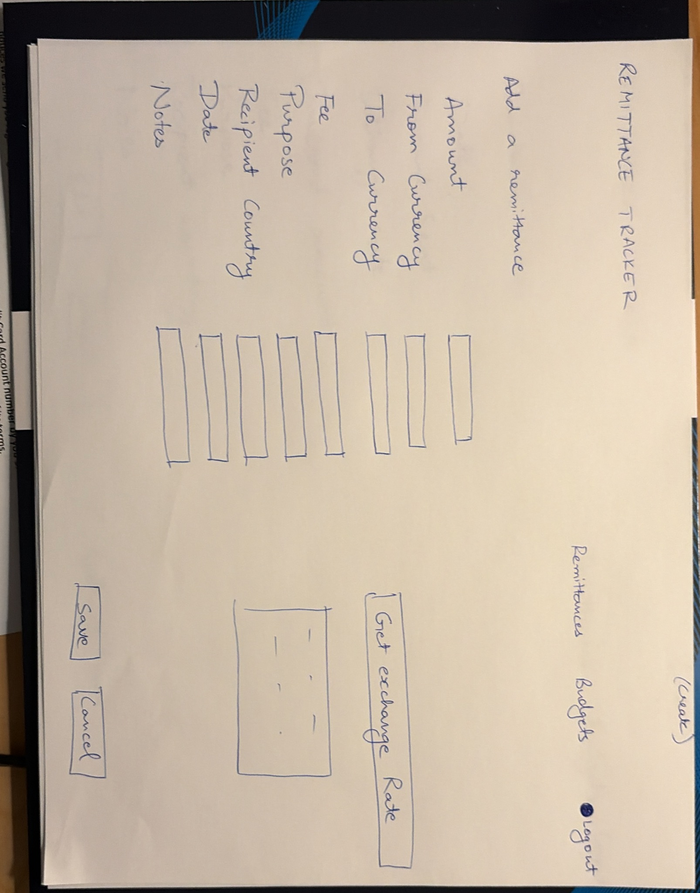
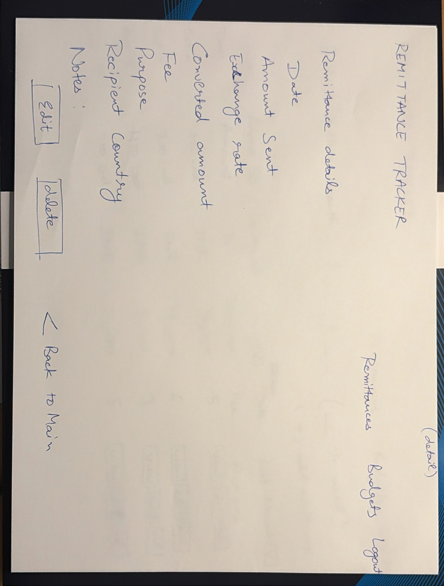
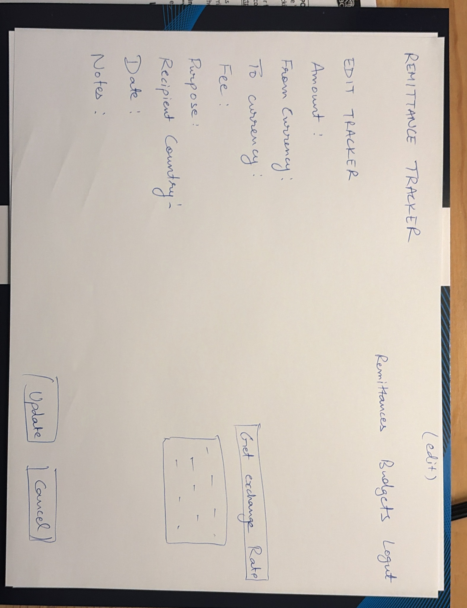

# Remittance Tracker for International Students

## External API
- **Name:** Frankfurter Currency Exchange API
- **Docs:** https://frankfurter.app/docs
- **Key Required:** No. It is completely free and open source.
- **Rate Limits/Terms:** Free to use for non-commercial purposes. We will call it through our Express server, not directly from the frontend.
- **Feature Used:** Getting the current exchange rate to show the approximate converted amount when a user records a remittance.
- **Real Request Example:** 
  `https://api.frankfurter.app/latest?from=CAD&to=INR`
- **Trimmed Response Example:**
  ```json
  {
    "amount": 1.0,
    "base": "CAD",
    "date": "2026-10-07",
    "rates": {
      "INR": 62.54
    }
  }


## Endpoint List
| Method | Path | What it does | Success Code | Error Codes |
|---|---|---|---|---|
| GET | `/api/remittances` | Lists all remittances for the logged-in user | 200 | 401, 500 |
| GET | `/api/remittances/:id` | Gets details of a single remittance | 200 | 404, 401 |
| POST | `/api/remittances` | Creates a new remittance transaction | 201 | 400, 401 |
| PATCH | `/api/remittances/:id` | Updates an existing remittance | 200 | 400, 404, 401 |
| DELETE | `/api/remittances/:id` | Deletes a remittance | 204 | 404, 401 |
| GET | `/api/budgets` | Lists all budgets for the logged-in user | 200 | 401, 500 |
| GET | `/api/budgets/:id` | Gets details of a single budget | 200 | 404, 401 |
| POST | `/api/budgets` | Creates a new monthly budget | 201 | 400, 401 |
| PATCH | `/api/budgets/:id` | Updates an existing budget | 200 | 400, 404, 401 |
| DELETE | `/api/budgets/:id` | Deletes a budget | 204 | 404, 401 |
| GET | `/api/exchange-rates?from=CAD&to=INR` | Fetches live conversion rate from Frankfurter API | 200 | 400, 502 |


## Wireframes

Photos of paper sketches of the main screens.

#List


## Create


##Detail


##Edit


#Team Roles

API | Amrit 

Frontend, Repo and pull requests | Bhupinder

Database | Sitakant 


